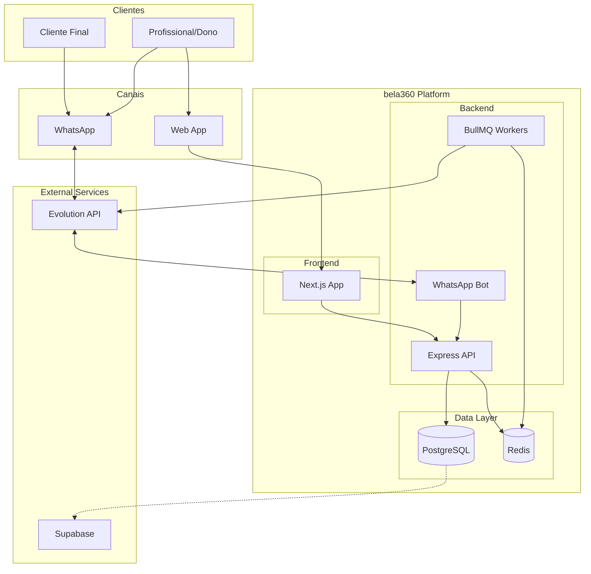
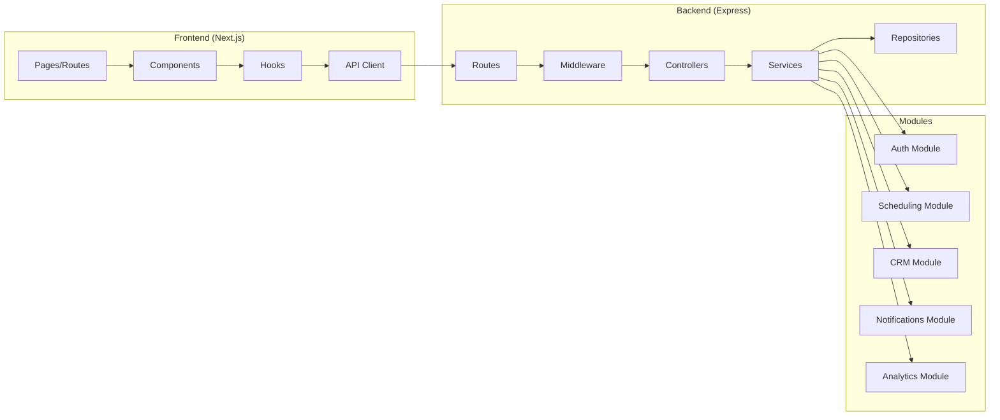
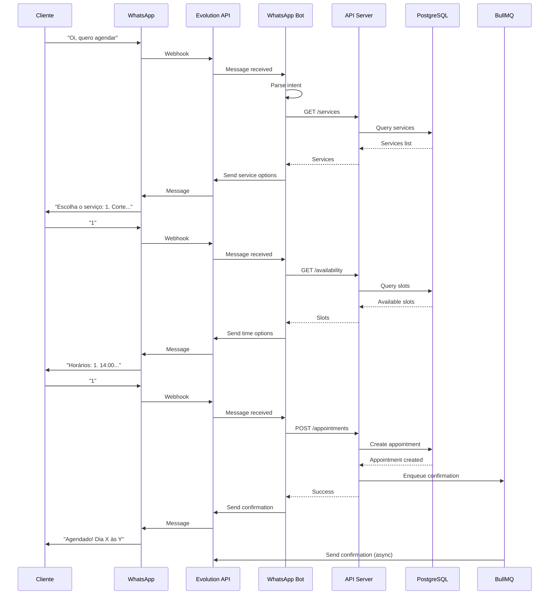
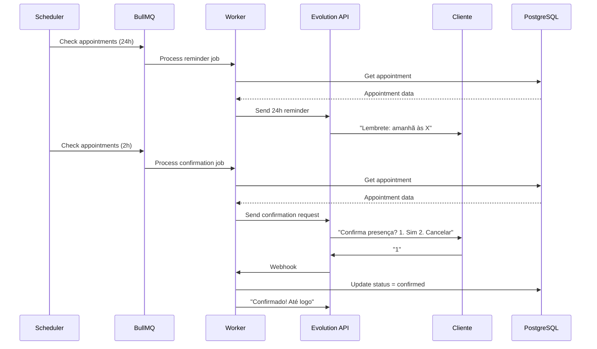

# bela360 Architecture Document

## Introduction

Este documento descreve a arquitetura técnica do **bela360**, uma plataforma de automação para negócios de beleza no Brasil. Serve como blueprint para desenvolvimento, garantindo consistência e aderência aos padrões escolhidos.

**Relationship to Frontend Architecture:**
O projeto inclui interface web responsiva (mobile-first). A arquitetura frontend está integrada neste documento dado o escopo MVP.

### Starter Template

**N/A** - Projeto greenfield sem starter template. Estrutura será criada do zero seguindo as convenções definidas aqui.

### Change Log

| Date | Version | Description | Author |
|------|---------|-------------|--------|
| 2025-01-04 | 0.1 | Versão inicial da arquitetura | BMad Orchestrator |

---

## High Level Architecture

### Technical Summary

O bela360 utiliza arquitetura **monolítica modular** em um **monorepo**, otimizada para velocidade de desenvolvimento no MVP. O sistema é composto por um frontend Next.js, backend Node.js/Express, banco PostgreSQL e integração com WhatsApp via Evolution API. A comunicação com clientes é gerenciada por um sistema de filas (BullMQ/Redis) para processamento assíncrono de mensagens. Esta arquitetura suporta os objetivos do PRD de MVP rápido, custo mínimo e escalabilidade futura.

### High Level Overview

1. **Arquitetura:** Monolito Modular - separação lógica em módulos internos (Auth, Scheduling, CRM, Notifications, Analytics) dentro de uma única aplicação
2. **Repositório:** Monorepo com pnpm workspaces
3. **Service Architecture:** Backend único com módulos bem definidos, preparado para extração futura
4. **User Flow:** Cliente interage via WhatsApp → Bot processa → Agenda atualizada → Dashboard reflete
5. **Decisões-chave:**
   - WhatsApp como canal principal (Evolution API para MVP)
   - Free tiers priorizados (Supabase, Vercel, Railway)
   - Mobile-first web app (sem app nativo no MVP)

### High Level Project Diagram



### Architectural and Design Patterns

- **Monolith Modular:** Aplicação única com separação em módulos por domínio - _Rationale:_ Simplicidade para MVP, menor overhead operacional, fácil refatoração futura

- **Repository Pattern:** Camada de abstração para acesso a dados - _Rationale:_ Desacopla lógica de negócio do ORM, facilita testes e possíveis migrações

- **Queue-based Messaging:** BullMQ para processamento assíncrono - _Rationale:_ Desacopla envio de mensagens do fluxo principal, retry automático, rate limiting

- **JWT Authentication:** Tokens stateless para sessões - _Rationale:_ Escalável, sem estado no servidor, fácil integração com WhatsApp OTP

- **Event-Driven (interno):** Eventos para comunicação entre módulos - _Rationale:_ Baixo acoplamento, extensibilidade para novas features

---

## Tech Stack

### Cloud Infrastructure

- **Provider:** Multi-cloud (Free Tiers)
  - Vercel (Frontend)
  - Railway ou Render (Backend)
  - Supabase (PostgreSQL + Auth helpers)
  - Upstash (Redis serverless)
- **Key Services:** PostgreSQL, Redis, Serverless Functions
- **Deployment Regions:** São Paulo (GRU) - baixa latência para Brasil

### Technology Stack Table

| Category | Technology | Version | Purpose | Rationale |
|----------|------------|---------|---------|-----------|
| **Language** | TypeScript | 5.3+ | Linguagem principal | Type safety, DX, compartilhamento de tipos |
| **Runtime** | Node.js | 20 LTS | Runtime backend | Estável, ecosistema maduro |
| **Frontend Framework** | Next.js | 14.x | Web app | SSR, App Router, deploy fácil Vercel |
| **UI Library** | React | 18.x | Componentes UI | Padrão de mercado, ecosystem rico |
| **Styling** | Tailwind CSS | 3.4+ | Estilos | Utility-first, mobile-first, rápido |
| **UI Components** | shadcn/ui | latest | Componentes base | Acessível, customizável, sem vendor lock |
| **Backend Framework** | Express | 4.18+ | API server | Simples, flexível, maduro |
| **ORM** | Prisma | 5.x | Database access | Type-safe, migrations, DX excelente |
| **Database** | PostgreSQL | 15+ | Dados principais | Robusto, Supabase free tier |
| **Cache/Queue** | Redis | 7+ | Cache e filas | BullMQ, sessões, Upstash free tier |
| **Queue Library** | BullMQ | 5.x | Job processing | Reliable, dashboard, retry |
| **WhatsApp API** | Evolution API | 2.x | Mensagens WhatsApp | Open source, custo zero |
| **Auth** | Custom JWT | - | Autenticação | Simples, WhatsApp OTP |
| **Validation** | Zod | 3.x | Schema validation | TypeScript-first, runtime checks |
| **Testing** | Vitest | 1.x | Unit/Integration tests | Rápido, compatível Jest API |
| **E2E Testing** | Playwright | 1.x | End-to-end tests | Multi-browser, reliable |
| **Linting** | ESLint + Prettier | 8.x / 3.x | Code quality | Consistência, auto-fix |
| **Monorepo** | pnpm workspaces | 8.x | Package management | Rápido, eficiente, hoisting |
| **CI/CD** | GitHub Actions | - | Automation | Integrado, free para público |
| **Monitoring** | Sentry | - | Error tracking | Free tier generoso |

---

## Data Models

### Business (Negócio)

**Purpose:** Representa o salão/barbearia/estúdio cadastrado

**Key Attributes:**
- `id`: UUID - Identificador único
- `name`: string - Nome do negócio
- `phone`: string - WhatsApp principal
- `address`: string? - Endereço (opcional)
- `workingHours`: JSON - Horários de funcionamento
- `slotDuration`: number - Intervalo entre agendamentos (minutos)
- `createdAt`: datetime - Data de cadastro

**Relationships:**
- Has many Services
- Has many Appointments
- Has many Clients

---

### Service (Serviço)

**Purpose:** Serviços oferecidos pelo negócio

**Key Attributes:**
- `id`: UUID - Identificador único
- `businessId`: UUID - FK para Business
- `name`: string - Nome do serviço
- `description`: string? - Descrição
- `duration`: number - Duração em minutos
- `price`: decimal - Preço
- `active`: boolean - Se está disponível
- `order`: number - Ordem de exibição

**Relationships:**
- Belongs to Business
- Has many Appointments

---

### Client (Cliente)

**Purpose:** Clientes que agendam serviços

**Key Attributes:**
- `id`: UUID - Identificador único
- `businessId`: UUID - FK para Business
- `phone`: string - WhatsApp (único por business)
- `name`: string - Nome
- `notes`: string? - Observações do profissional
- `tags`: string[] - Tags (VIP, Novo, etc)
- `createdAt`: datetime - Primeiro contato
- `lastVisit`: datetime? - Última visita

**Relationships:**
- Belongs to Business
- Has many Appointments

---

### Appointment (Agendamento)

**Purpose:** Agendamentos de serviços

**Key Attributes:**
- `id`: UUID - Identificador único
- `businessId`: UUID - FK para Business
- `clientId`: UUID - FK para Client
- `serviceId`: UUID - FK para Service
- `datetime`: datetime - Data e hora do agendamento
- `status`: enum - scheduled, confirmed, completed, cancelled, no_show
- `notes`: string? - Observações
- `createdAt`: datetime - Quando foi criado
- `confirmedAt`: datetime? - Quando foi confirmado

**Relationships:**
- Belongs to Business, Client, Service
- Has many Notifications

---

### BlockedSlot (Horário Bloqueado)

**Purpose:** Horários indisponíveis (folga, almoço, etc)

**Key Attributes:**
- `id`: UUID - Identificador único
- `businessId`: UUID - FK para Business
- `startTime`: datetime - Início do bloqueio
- `endTime`: datetime - Fim do bloqueio
- `reason`: string? - Motivo
- `recurring`: boolean - Se repete semanalmente

**Relationships:**
- Belongs to Business

---

### Notification (Notificação)

**Purpose:** Log de mensagens enviadas

**Key Attributes:**
- `id`: UUID - Identificador único
- `appointmentId`: UUID? - FK para Appointment
- `businessId`: UUID - FK para Business
- `phone`: string - Destinatário
- `type`: enum - confirmation, reminder_24h, reminder_2h, no_show, custom
- `status`: enum - pending, sent, delivered, failed
- `content`: string - Conteúdo da mensagem
- `sentAt`: datetime? - Quando foi enviada
- `deliveredAt`: datetime? - Quando foi entregue

**Relationships:**
- Belongs to Appointment (optional), Business

---

## Components

### Web App (Frontend)

**Responsibility:** Interface do usuário para profissionais gerenciarem seus negócios

**Key Interfaces:**
- Dashboard com agenda do dia
- Calendário semanal
- Lista e perfil de clientes
- Configurações de serviços e horários
- Relatórios básicos

**Dependencies:** API Backend

**Technology Stack:** Next.js 14, React, Tailwind CSS, shadcn/ui

---

### API Server (Backend)

**Responsibility:** Lógica de negócio, persistência, autenticação

**Key Interfaces:**
- REST API para frontend
- Webhooks para Evolution API
- Gerenciamento de jobs BullMQ

**Dependencies:** PostgreSQL, Redis, Evolution API

**Technology Stack:** Express, Prisma, Zod, BullMQ

---

### WhatsApp Bot

**Responsibility:** Processamento de mensagens do WhatsApp, fluxo conversacional

**Key Interfaces:**
- Webhook receiver
- State machine para conversação
- Comandos de agendamento

**Dependencies:** API Server, Evolution API

**Technology Stack:** Express routes, in-memory state

---

### Queue Workers

**Responsibility:** Processamento assíncrono de notificações

**Key Interfaces:**
- Confirmation worker
- Reminder workers (24h, 2h)
- No-show detection worker

**Dependencies:** Redis, Evolution API

**Technology Stack:** BullMQ workers

---

### Component Diagrams



---

## External APIs

### Evolution API

- **Purpose:** Integração com WhatsApp para envio/recebimento de mensagens
- **Documentation:** https://doc.evolution-api.com
- **Base URL(s):** Self-hosted ou cloud instance
- **Authentication:** API Key
- **Rate Limits:** Depende do plano/instance

**Key Endpoints Used:**
- `POST /message/sendText` - Enviar mensagem de texto
- `POST /message/sendButtons` - Enviar mensagem com botões
- `GET /instance/connectionState` - Verificar conexão
- Webhook para receber mensagens

**Integration Notes:**
- Requer instance rodando (Docker ou cloud)
- Webhook deve ser configurado para receber mensagens
- Respeitar rate limits do WhatsApp (~100 msg/min)

---

## Core Workflows

### Fluxo de Agendamento via WhatsApp



### Fluxo de Lembrete e Confirmação



---

## REST API Spec

```yaml
openapi: 3.0.0
info:
  title: bela360 API
  version: 1.0.0
  description: API para gestão de agendamentos de negócios de beleza

servers:
  - url: https://api.bela360.com.br/v1
    description: Production
  - url: http://localhost:3001/v1
    description: Development

paths:
  /auth/request-code:
    post:
      summary: Solicitar código de verificação via WhatsApp
      requestBody:
        required: true
        content:
          application/json:
            schema:
              type: object
              properties:
                phone:
                  type: string
                  example: "5511999999999"
      responses:
        200:
          description: Código enviado

  /auth/verify:
    post:
      summary: Verificar código e obter tokens
      requestBody:
        required: true
        content:
          application/json:
            schema:
              type: object
              properties:
                phone:
                  type: string
                code:
                  type: string
      responses:
        200:
          description: Autenticado
          content:
            application/json:
              schema:
                type: object
                properties:
                  accessToken:
                    type: string
                  refreshToken:
                    type: string

  /business:
    get:
      summary: Obter perfil do negócio
      security:
        - bearerAuth: []
      responses:
        200:
          description: Dados do negócio

    put:
      summary: Atualizar perfil do negócio
      security:
        - bearerAuth: []
      responses:
        200:
          description: Negócio atualizado

  /services:
    get:
      summary: Listar serviços
      security:
        - bearerAuth: []
      responses:
        200:
          description: Lista de serviços

    post:
      summary: Criar serviço
      security:
        - bearerAuth: []
      responses:
        201:
          description: Serviço criado

  /appointments:
    get:
      summary: Listar agendamentos
      security:
        - bearerAuth: []
      parameters:
        - name: date
          in: query
          schema:
            type: string
            format: date
        - name: status
          in: query
          schema:
            type: string
      responses:
        200:
          description: Lista de agendamentos

    post:
      summary: Criar agendamento
      security:
        - bearerAuth: []
      responses:
        201:
          description: Agendamento criado

  /appointments/{id}:
    patch:
      summary: Atualizar status do agendamento
      security:
        - bearerAuth: []
      parameters:
        - name: id
          in: path
          required: true
          schema:
            type: string
      responses:
        200:
          description: Agendamento atualizado

  /clients:
    get:
      summary: Listar clientes
      security:
        - bearerAuth: []
      parameters:
        - name: search
          in: query
          schema:
            type: string
      responses:
        200:
          description: Lista de clientes

  /clients/{id}:
    get:
      summary: Obter perfil do cliente
      security:
        - bearerAuth: []
      responses:
        200:
          description: Dados do cliente

    patch:
      summary: Atualizar cliente
      security:
        - bearerAuth: []
      responses:
        200:
          description: Cliente atualizado

  /analytics/dashboard:
    get:
      summary: Dados do dashboard
      security:
        - bearerAuth: []
      responses:
        200:
          description: Métricas do dashboard

  /health:
    get:
      summary: Health check
      responses:
        200:
          description: Sistema saudável

components:
  securitySchemes:
    bearerAuth:
      type: http
      scheme: bearer
      bearerFormat: JWT
```

---

## Database Schema

```sql
-- Enable UUID extension
CREATE EXTENSION IF NOT EXISTS "uuid-ossp";

-- Business table
CREATE TABLE businesses (
    id UUID PRIMARY KEY DEFAULT uuid_generate_v4(),
    name VARCHAR(255) NOT NULL,
    phone VARCHAR(20) UNIQUE NOT NULL,
    address TEXT,
    working_hours JSONB NOT NULL DEFAULT '{}',
    slot_duration INTEGER NOT NULL DEFAULT 30,
    created_at TIMESTAMP WITH TIME ZONE DEFAULT NOW(),
    updated_at TIMESTAMP WITH TIME ZONE DEFAULT NOW()
);

-- Services table
CREATE TABLE services (
    id UUID PRIMARY KEY DEFAULT uuid_generate_v4(),
    business_id UUID NOT NULL REFERENCES businesses(id) ON DELETE CASCADE,
    name VARCHAR(255) NOT NULL,
    description TEXT,
    duration INTEGER NOT NULL, -- minutes
    price DECIMAL(10, 2) NOT NULL,
    active BOOLEAN NOT NULL DEFAULT true,
    sort_order INTEGER NOT NULL DEFAULT 0,
    created_at TIMESTAMP WITH TIME ZONE DEFAULT NOW(),
    updated_at TIMESTAMP WITH TIME ZONE DEFAULT NOW()
);

CREATE INDEX idx_services_business ON services(business_id);

-- Clients table
CREATE TABLE clients (
    id UUID PRIMARY KEY DEFAULT uuid_generate_v4(),
    business_id UUID NOT NULL REFERENCES businesses(id) ON DELETE CASCADE,
    phone VARCHAR(20) NOT NULL,
    name VARCHAR(255) NOT NULL,
    notes TEXT,
    tags TEXT[] DEFAULT '{}',
    last_visit TIMESTAMP WITH TIME ZONE,
    created_at TIMESTAMP WITH TIME ZONE DEFAULT NOW(),
    updated_at TIMESTAMP WITH TIME ZONE DEFAULT NOW(),
    UNIQUE(business_id, phone)
);

CREATE INDEX idx_clients_business ON clients(business_id);
CREATE INDEX idx_clients_phone ON clients(phone);

-- Appointments table
CREATE TYPE appointment_status AS ENUM ('scheduled', 'confirmed', 'completed', 'cancelled', 'no_show');

CREATE TABLE appointments (
    id UUID PRIMARY KEY DEFAULT uuid_generate_v4(),
    business_id UUID NOT NULL REFERENCES businesses(id) ON DELETE CASCADE,
    client_id UUID NOT NULL REFERENCES clients(id),
    service_id UUID NOT NULL REFERENCES services(id),
    datetime TIMESTAMP WITH TIME ZONE NOT NULL,
    status appointment_status NOT NULL DEFAULT 'scheduled',
    notes TEXT,
    confirmed_at TIMESTAMP WITH TIME ZONE,
    created_at TIMESTAMP WITH TIME ZONE DEFAULT NOW(),
    updated_at TIMESTAMP WITH TIME ZONE DEFAULT NOW()
);

CREATE INDEX idx_appointments_business ON appointments(business_id);
CREATE INDEX idx_appointments_datetime ON appointments(datetime);
CREATE INDEX idx_appointments_status ON appointments(status);
CREATE INDEX idx_appointments_client ON appointments(client_id);

-- Blocked slots table
CREATE TABLE blocked_slots (
    id UUID PRIMARY KEY DEFAULT uuid_generate_v4(),
    business_id UUID NOT NULL REFERENCES businesses(id) ON DELETE CASCADE,
    start_time TIMESTAMP WITH TIME ZONE NOT NULL,
    end_time TIMESTAMP WITH TIME ZONE NOT NULL,
    reason VARCHAR(255),
    recurring BOOLEAN NOT NULL DEFAULT false,
    created_at TIMESTAMP WITH TIME ZONE DEFAULT NOW()
);

CREATE INDEX idx_blocked_slots_business ON blocked_slots(business_id);
CREATE INDEX idx_blocked_slots_time ON blocked_slots(start_time, end_time);

-- Notifications table
CREATE TYPE notification_type AS ENUM ('confirmation', 'reminder_24h', 'reminder_2h', 'no_show', 'custom');
CREATE TYPE notification_status AS ENUM ('pending', 'sent', 'delivered', 'failed');

CREATE TABLE notifications (
    id UUID PRIMARY KEY DEFAULT uuid_generate_v4(),
    business_id UUID NOT NULL REFERENCES businesses(id) ON DELETE CASCADE,
    appointment_id UUID REFERENCES appointments(id) ON DELETE SET NULL,
    phone VARCHAR(20) NOT NULL,
    type notification_type NOT NULL,
    status notification_status NOT NULL DEFAULT 'pending',
    content TEXT NOT NULL,
    sent_at TIMESTAMP WITH TIME ZONE,
    delivered_at TIMESTAMP WITH TIME ZONE,
    created_at TIMESTAMP WITH TIME ZONE DEFAULT NOW()
);

CREATE INDEX idx_notifications_business ON notifications(business_id);
CREATE INDEX idx_notifications_appointment ON notifications(appointment_id);

-- Auth tokens table (for refresh tokens)
CREATE TABLE refresh_tokens (
    id UUID PRIMARY KEY DEFAULT uuid_generate_v4(),
    business_id UUID NOT NULL REFERENCES businesses(id) ON DELETE CASCADE,
    token VARCHAR(500) NOT NULL UNIQUE,
    expires_at TIMESTAMP WITH TIME ZONE NOT NULL,
    created_at TIMESTAMP WITH TIME ZONE DEFAULT NOW()
);

CREATE INDEX idx_refresh_tokens_business ON refresh_tokens(business_id);
CREATE INDEX idx_refresh_tokens_token ON refresh_tokens(token);
```

---

## Source Tree

```
bela360/
├── apps/
│   ├── web/                          # Frontend Next.js
│   │   ├── src/
│   │   │   ├── app/                  # App Router pages
│   │   │   │   ├── (auth)/           # Auth pages (login)
│   │   │   │   ├── (dashboard)/      # Protected pages
│   │   │   │   │   ├── page.tsx      # Dashboard home
│   │   │   │   │   ├── agenda/       # Calendar views
│   │   │   │   │   ├── clientes/     # Client management
│   │   │   │   │   ├── servicos/     # Service management
│   │   │   │   │   ├── relatorios/   # Analytics
│   │   │   │   │   └── config/       # Settings
│   │   │   │   └── layout.tsx
│   │   │   ├── components/
│   │   │   │   ├── ui/               # shadcn/ui components
│   │   │   │   ├── forms/            # Form components
│   │   │   │   ├── dashboard/        # Dashboard specific
│   │   │   │   └── layout/           # Layout components
│   │   │   ├── hooks/                # Custom React hooks
│   │   │   ├── lib/                  # Utilities
│   │   │   │   ├── api.ts            # API client
│   │   │   │   └── utils.ts
│   │   │   └── styles/
│   │   │       └── globals.css
│   │   ├── public/
│   │   ├── next.config.js
│   │   ├── tailwind.config.js
│   │   ├── tsconfig.json
│   │   └── package.json
│   │
│   └── api/                          # Backend Express
│       ├── src/
│       │   ├── modules/
│       │   │   ├── auth/
│       │   │   │   ├── auth.controller.ts
│       │   │   │   ├── auth.service.ts
│       │   │   │   ├── auth.routes.ts
│       │   │   │   └── auth.types.ts
│       │   │   ├── scheduling/
│       │   │   │   ├── scheduling.controller.ts
│       │   │   │   ├── scheduling.service.ts
│       │   │   │   ├── scheduling.routes.ts
│       │   │   │   ├── availability.service.ts
│       │   │   │   └── scheduling.types.ts
│       │   │   ├── crm/
│       │   │   │   ├── clients.controller.ts
│       │   │   │   ├── clients.service.ts
│       │   │   │   └── clients.routes.ts
│       │   │   ├── notifications/
│       │   │   │   ├── notifications.service.ts
│       │   │   │   ├── notifications.routes.ts
│       │   │   │   └── workers/
│       │   │   │       ├── confirmation.worker.ts
│       │   │   │       ├── reminder.worker.ts
│       │   │   │       └── noshow.worker.ts
│       │   │   ├── analytics/
│       │   │   │   ├── analytics.controller.ts
│       │   │   │   ├── analytics.service.ts
│       │   │   │   └── analytics.routes.ts
│       │   │   └── whatsapp/
│       │   │       ├── whatsapp.controller.ts
│       │   │       ├── whatsapp.service.ts
│       │   │       ├── bot.service.ts
│       │   │       └── whatsapp.routes.ts
│       │   ├── common/
│       │   │   ├── middleware/
│       │   │   │   ├── auth.middleware.ts
│       │   │   │   ├── error.middleware.ts
│       │   │   │   └── validation.middleware.ts
│       │   │   ├── utils/
│       │   │   ├── errors/
│       │   │   └── types/
│       │   ├── config/
│       │   │   ├── database.ts
│       │   │   ├── redis.ts
│       │   │   ├── queue.ts
│       │   │   └── env.ts
│       │   ├── app.ts
│       │   └── server.ts
│       ├── prisma/
│       │   ├── schema.prisma
│       │   ├── migrations/
│       │   └── seed.ts
│       ├── tests/
│       │   ├── unit/
│       │   ├── integration/
│       │   └── fixtures/
│       ├── tsconfig.json
│       └── package.json
│
├── packages/
│   └── shared/                       # Shared types and utils
│       ├── src/
│       │   ├── types/
│       │   │   ├── models.ts
│       │   │   ├── api.ts
│       │   │   └── index.ts
│       │   └── utils/
│       ├── tsconfig.json
│       └── package.json
│
├── .github/
│   └── workflows/
│       ├── ci.yml
│       └── deploy.yml
│
├── docs/
│   ├── brief.md
│   ├── prd.md
│   ├── architecture.md
│   ├── prd/                          # Sharded PRD
│   ├── architecture/                 # Sharded architecture
│   ├── stories/                      # User stories
│   └── qa/                           # QA documentation
│
├── .env.example
├── .gitignore
├── .eslintrc.js
├── .prettierrc
├── pnpm-workspace.yaml
├── package.json
├── turbo.json                        # If using Turborepo
└── README.md
```

---

## Infrastructure and Deployment

### Infrastructure as Code

- **Tool:** GitHub Actions + Platform CLIs
- **Location:** `.github/workflows/`
- **Approach:** Platform-managed infra (Vercel, Railway, Supabase) - sem IaC complexo para MVP

### Deployment Strategy

- **Strategy:** Blue-Green via platform (Vercel automatic)
- **CI/CD Platform:** GitHub Actions
- **Pipeline Configuration:** `.github/workflows/deploy.yml`

### Environments

- **Development:** Local com Docker Compose
- **Staging:** Preview deployments automáticos em PRs
- **Production:** Deploy automático em push para main

### Environment Promotion Flow

```
feature branch → PR → staging preview → code review → merge to main → production
```

### Rollback Strategy

- **Primary Method:** Git revert + automatic redeploy
- **Trigger Conditions:** Erros em produção detectados via Sentry, falha de health check
- **Recovery Time Objective:** < 5 minutos (Vercel instant rollback)

---

## Error Handling Strategy

### General Approach

- **Error Model:** Custom error classes com códigos padronizados
- **Exception Hierarchy:** BaseError → ValidationError, AuthError, NotFoundError, etc.
- **Error Propagation:** Erros capturados em controllers, logados, e retornados em formato padrão

### Logging Standards

- **Library:** Pino 8.x
- **Format:** JSON estruturado
- **Levels:** error, warn, info, debug
- **Required Context:**
  - Correlation ID: UUID por request
  - Service Context: Nome do módulo
  - User Context: businessId (quando autenticado)

### Error Handling Patterns

#### External API Errors (WhatsApp)
- **Retry Policy:** 3 tentativas com exponential backoff (1s, 2s, 4s)
- **Circuit Breaker:** Após 5 falhas consecutivas, pausa 30s
- **Timeout Configuration:** 10s para envio de mensagem
- **Error Translation:** Erros da Evolution API mapeados para erros internos

#### Business Logic Errors
- **Custom Exceptions:** ValidationError, ConflictError (slot ocupado), etc.
- **User-Facing Errors:** Mensagens em português, sem detalhes técnicos
- **Error Codes:** BELA_XXX (ex: BELA_001 = slot indisponível)

#### Data Consistency
- **Transaction Strategy:** Transações Prisma para operações multi-tabela
- **Compensation Logic:** Rollback manual se job de notificação falhar
- **Idempotency:** appointmentId + type para evitar notificações duplicadas

---

## Coding Standards

### Core Standards

- **Languages & Runtimes:** TypeScript 5.3+, Node.js 20 LTS
- **Style & Linting:** ESLint + Prettier (config compartilhado no root)
- **Test Organization:** `*.test.ts` co-located ou em `tests/`

### Naming Conventions

| Element | Convention | Example |
|---------|------------|---------|
| Files | kebab-case | `auth.service.ts` |
| Classes | PascalCase | `AuthService` |
| Functions | camelCase | `createAppointment` |
| Constants | UPPER_SNAKE | `MAX_RETRY_COUNT` |
| Types/Interfaces | PascalCase | `Appointment`, `CreateAppointmentDto` |

### Critical Rules

- **Nunca use console.log:** Use o logger (Pino) em todo código
- **Sempre valide inputs:** Use Zod schemas em todas as rotas
- **Repository Pattern:** Queries via repository, nunca Prisma direto em services
- **Erros tipados:** Sempre lance custom errors, nunca `throw new Error()`
- **Env vars:** Acesse via config, nunca `process.env` direto
- **Datas:** Sempre use UTC, converta apenas na apresentação
- **WhatsApp format:** Telefones sempre no formato 5511999999999

---

## Test Strategy and Standards

### Testing Philosophy

- **Approach:** Test-after para MVP, TDD para features críticas
- **Coverage Goals:** 70% em services, 50% geral
- **Test Pyramid:** 70% unit, 25% integration, 5% e2e

### Test Types and Organization

#### Unit Tests
- **Framework:** Vitest 1.x
- **File Convention:** `*.test.ts` co-located
- **Location:** Junto ao arquivo testado
- **Mocking Library:** vitest mocks + msw para APIs
- **Coverage Requirement:** 70% em services

#### Integration Tests
- **Scope:** Fluxos completos (API → DB)
- **Location:** `apps/api/tests/integration/`
- **Database:** Supabase local ou testcontainers PostgreSQL
- **External APIs:** MSW para mock do Evolution API

#### E2E Tests
- **Framework:** Playwright 1.x
- **Scope:** Fluxos críticos (login, agendamento)
- **Environment:** Staging preview
- **Test Data:** Seeds específicos para teste

### Continuous Testing

- **CI Integration:** Tests rodam em todo PR
- **Performance Tests:** Não para MVP
- **Security Tests:** npm audit em CI

---

## Security

### Input Validation

- **Validation Library:** Zod
- **Validation Location:** Middleware antes do controller
- **Required Rules:**
  - Todos inputs externos validados
  - Whitelist de campos aceitos
  - Sanitização de strings

### Authentication & Authorization

- **Auth Method:** JWT com OTP via WhatsApp
- **Session Management:** Access token (1h) + Refresh token (7d)
- **Required Patterns:**
  - Middleware de auth em todas rotas protegidas
  - businessId do token, nunca do body

### Secrets Management

- **Development:** .env.local (não commitado)
- **Production:** Environment variables da plataforma
- **Code Requirements:**
  - Nunca hardcode secrets
  - Acesso via módulo config
  - Sem secrets em logs

### API Security

- **Rate Limiting:** 100 req/min por IP (express-rate-limit)
- **CORS Policy:** Origins específicos (domínio do frontend)
- **Security Headers:** Helmet.js
- **HTTPS Enforcement:** Via plataforma (Vercel, Railway)

### Data Protection

- **Encryption at Rest:** Via Supabase/plataforma
- **Encryption in Transit:** HTTPS obrigatório
- **PII Handling:** Telefones e nomes são PII, seguir LGPD
- **Logging Restrictions:** Nunca logar telefones completos, tokens, mensagens

### Dependency Security

- **Scanning Tool:** npm audit + Dependabot
- **Update Policy:** Patches imediatos, minors mensais
- **Approval Process:** Review de novas deps em PR

---

## Next Steps

### Architect Prompt (Frontend Details)

> O documento de arquitetura está completo. As decisões de frontend (Next.js, Tailwind, shadcn/ui) já estão documentadas. Proceder com implementação das stories conforme o PRD.

### Developer Prompt

> Use este documento de arquitetura junto com o PRD para implementar as stories do Epic 1. Comece pelo setup do monorepo e configuração de CI/CD.
